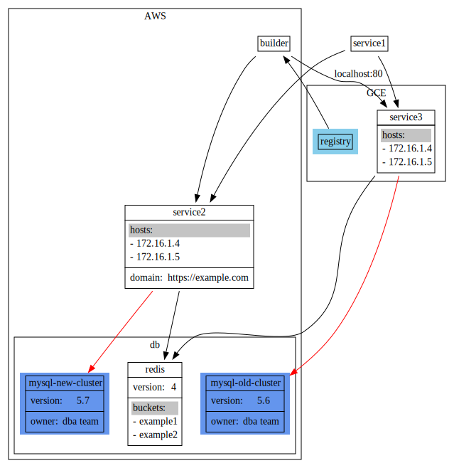

# coarse-cli
Cli for https://github.com/ismay/coarse which convert svg file to sketch with [Rough.js](https://roughjs.com)


## usage
```bash
$ npm install @kaleocheng/coarse-cli

# convert one svg
$ coarse input.svg output.svg

# convert all svg files in folder
$ coarse --source-dir input/ --target-dir output/
```

## example

 to 
